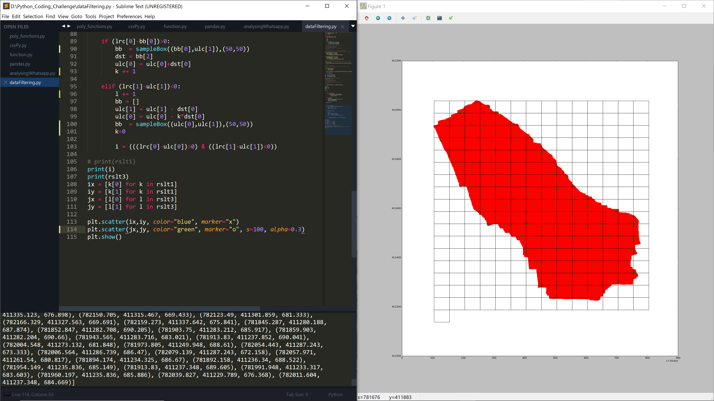

# Cloudy is a downsampling application for downsampling point clouds. It functions by finding min() and max() of point clouds in a sampling window defined by the user.

If you have a point cloud file in .txt and you want to find the min() or max() or both for given cell size, 
just change the file directory in the open() function and also change the cell size in the sampleBox() function. 
When the code is ran, it will show interactively in a matplot figure untill the processing is complete.

